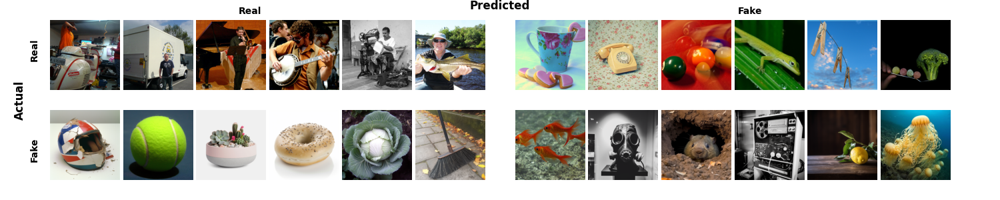
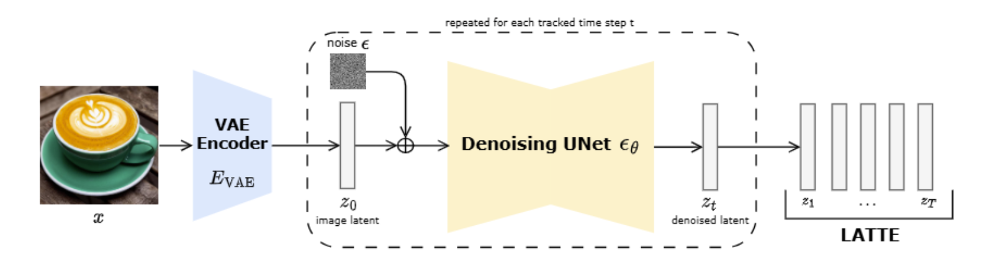
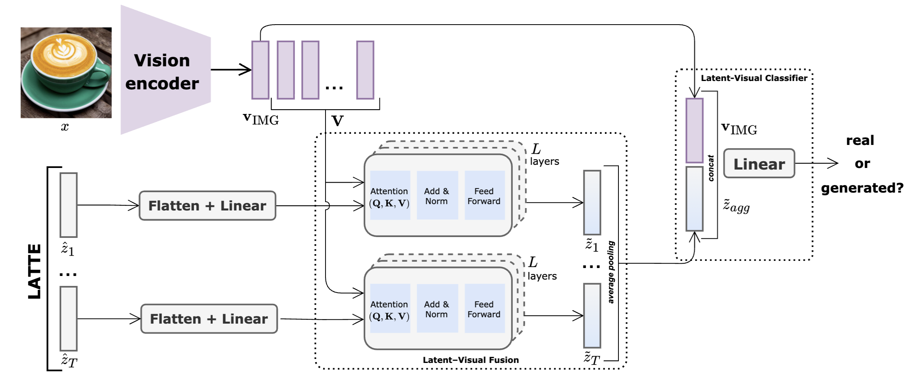
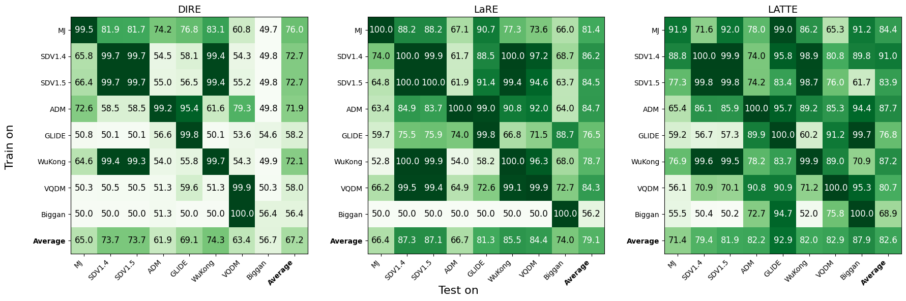

<div align="center">
<br>
<h1>🧋LATTE: Latent Trajectory Embedding for Diffusion-Generated Image Detection</h1>

[Ana Vasilcoiu](https://scholar.google.com/citations?user=KdfvSf8AAAAJ&hl=ro)<sup>1</sup>* [Ivona Najdenkoska](https://ivonajdenkoska.github.io/)<sup>1,2</sup>*, [Zeno Geradts](https://www.uva.nl/en/profile/g/e/z.j.m.h.geradts/z.j.m.h.geradts.html)<sup>2</sup>, [Marcel Worring](https://staff.fnwi.uva.nl/m.worring/)<sup>1</sup>

<sup>1</sup>University of Amsterdam, <sup>2</sup>Netherlands Forensic Institute (NFI)

<p align="center">
  <a href='https://arxiv.org/abs/2507.03054'>
    
  </a>
  <a href='https://arxiv.org/pdf/2507.03054'>
    
  </a>
</p>
</div>

<p align="center">
  
</p>

## 🌟 Highlights
- 🔬 **Detection of generated images** — A novel approach for detecting generated images by modeling the evolution of latent representations across the generative denoising process.
- 🌀 **Latent Trajectory Modeling** — Extracts multiple diffusion latents from Stable Diffusion into a trajectory sequence.  
- 🔗 **Latent–Visual Fusion** — Aligns the extracted latents with visual semantics using ConvNeXt/CLIP vision encoders.  
- 🧠 **Robust & Generalizable** — Outperforms **AIDE** and **LaRE** on **GenImage**, **Chameleon** and **Diffusion Forensics**, demonstrating both strong cross-generator and cross-domain performance.  

## 🧩 Method Details 
We construct the LATTE sequence by performing a single-step reconstruction for a selection of timesteps throughout the whole trajectory.
<p align="center">
  
</p>

It encompasses two stages: (1) Latent–Visual Fusion, where the LATTE is fused with visual semantics through stacks of L cross-attention layers, and (2) Latent-Visual Classifier for average aggregation and output prediction.
<p align="center">
  
</p>

## 🗂️ Project Structure
```
├── images
├──── # Folder with image resources
├── scripts
├──── # Folder with example scripts
├── clip_prompt_utils.py         # CLIP prompt tuning utilities prompt-tuning
├── dataset.py                   # Iterable dataset loader from cached latents
├── model.py                     # Model code for the different architectural configurations proposed
├── extract_latte.py             # Latent trajectory extraction from real/fake images
├── train.py                     # Distributed training script for LATTE classifier
├── test.py                      # Evaluation script for pretrained models
├── robustness.py                # Perturbation experiments and AP/accuracy visualization
├── heatmaps.py                  # Latent trajectory consistency analysis plotting 
└── README.md                    # You're here!
```

## ⚙️ Setup and Installation

### Requirements
- Python 3.8+
- PyTorch 2.7.0+cuda12.6

The environment containing the rest of the required packages can be installed via:
```
conda env create -f environment.yml
```

## 🚀 How it works

### 1. Latent Extraction
Use extract_latte.py to preprocess and extract latent sequences for real and fake images:
```
python extract_latte.py \
  --real_folders /path/to/real \
  --fake_folders /path/to/fake \
  --cache_dirs /output/path \
  --data_size 224 224 \
```

### 2. Model Training
Train the LATTE classifier on cached latent sequences:
```
torchrun --nproc_per_node=4 train.py \
  --latent_dir_train /output/path \
  --latent_dir_validation /validation/path \
  --model_type "LatentTrajectoryClassifier" \
  --clip_type "convnext_base_in22k" \
  --epochs 20 \
  --process_latents_separately
```

### 3. Evaluation and Robustness Testing
Evaluate trained models and test robustness against perturbations:
```
python test.py \
  --checkpoint checkpoints/best_model.pth \
  --latent_dirs_test /path/to/test_chunks_adm /path/to/test_chunks_glide ... \
  --method_names ADM GLIDE ... \
  --model_type "LatentTrajectoryClassifier" \
```

```
python robustness.py \
  --checkpoint checkpoints/best_model.pth \
  --latent_dir /path/to/test_chunks \
  --model_type "LatentTrajectoryClassifier"
```

## 📊 Benchmarks

### **GenImage**
Complete pairwise evaluation of detection performance across all 8 generators in the GenImage dataset. Each subplot corresponds to one detector - DIRE (left; baseline), LaRE (center; baseline), and LATTE (right; proposed) - and shows the accuracy(\%) when training on the subset listed on the vertical axis and testing on the subset listed along the horizontal axis. Row- and column-averages summarize each method's cross-model generalization capabilities.



### **Chameleon**
Results on the Chameleon benchmark highlight both the robustness of our approach and its effectiveness in generalizing across diverse visual domains.

| Training set  | AIDE (%)  |  LATTE (%) |
|---------------|-----------|------------|
| SDv1.4        |   62.6    |  **63.8**  |
| GenImage      |   65.8    |  **68.3**  |

### **DiffusionForensics**
Results of a cross-domain generalization experiment where both models have been trained on the SDv1.4 subset of GenImage and tested on all generator subsets across the 3 dataset subsets of DiffusionForensics.

| Subset        | LaRE (%)  |  AIDE (%)  |  LATTE (%) |
|---------------|-----------|------------|------------|
| Bedroom       | 69.5      |    74.6    |  **85.7**  |
| Celeba        | 90.0      |    75.5    |  **91.1**  |
| Imagenet      | 89.9      |    76.2    |  **91.1**  |

## 📜 Citation 
If you find the LATTE paper and code useful for your research and applications, please cite using this BibTeX:
```
@article{vasilcoiu2025latte,
  title={LATTE: Latent Trajectory Embedding for Diffusion-Generated Image Detection},
  author={Vasilcoiu, Ana and Najdenkoska, Ivona and Geradts, Zeno and Worring, Marcel},
  journal={arXiv preprint arXiv:2507.03054},
  year={2025}
}
```
