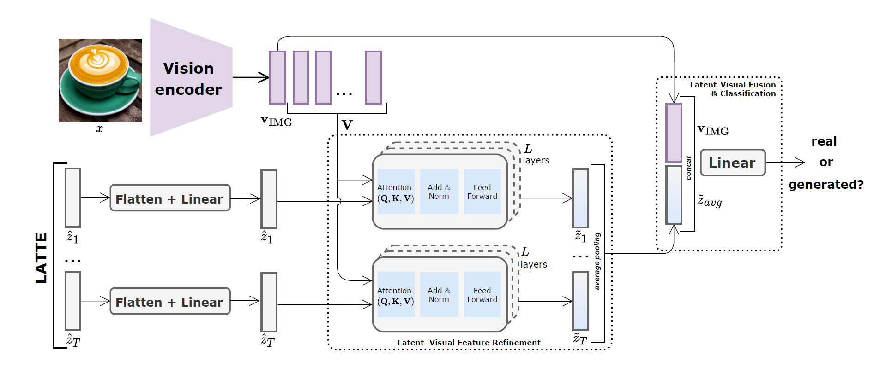

# LATTE: Latent Trajectory Embedding for Diffusion-Generated Image Detection

LATTE is a novel framework for detecting diffusion-generated images by modeling the evolution of latent representations across the generative denoising process. This project introduces a two-stage architecture that refines and aggregates latent trajectories, achieving robust and generalizable detection performance across multiple diffusion models and datasets.




## Key contributions
- **Latent Trajectory Representation**: Captures multiple latent states along the denoising trajectory of diffusion models using Stable Diffusion.
- **Cross-Attention Refinement**: Aligns each latent with image semantics from ConvNeXt or CLIP encoders via transformer decoders.
- **Unified Classification**: Aggregates refined latents (via average, weighted, or CLS pooling) for final prediction.
- **Robust and Generalizable**: Outperforms state-of-the-art methods (e.g., LaRE, DIRE) on GenImage and Diffusion Forensics datasets.

## Project Structure
```
├── images
├──── # Folder with image resources
├── scripts
├──── # Folder with example scripts
├── clip_prompt_utils.py         # CLIP prompt tuning utilities prompt-tuning
├── dataset.py                   # Iterable dataset loader from cached latents
├── model.py                     # Model code for the different architectural configurations proposed
├── extract_latte.py             # Latent trajectory extraction from real/fake images
├── train.py                     # Distributed training script for LATTE classifier
├── test.py                      # Evaluation script for pretrained models
├── robustness.py                # Perturbation experiments and AP/accuracy visualization
├── heatmaps.py                  # Latent trajectory consistency analysis plotting 
└── README.md                    # You're here!
```

## Setup and Installation

### Requirements
- Python 3.8+
- PyTorch 2.7.0+cuda12.6

The environment containing the rest of the required packages can be installed via:
```
conda env create -f environment.yml
```

## How it works

### 1. Latent Extraction
Use extract_latte.py to preprocess and extract latent sequences for real and fake images:
```
python extract_latte.py \
  --real_folders /path/to/real \
  --fake_folders /path/to/fake \
  --cache_dirs /output/path \
  --data_size 224 224 \
```

### 2. Model Training
Train the LATTE classifier on cached latent sequences:
```
torchrun --nproc_per_node=4 train.py \
  --latent_dir_train /output/path \
  --latent_dir_validation /validation/path \
  --model_type "TemporalCLIPLatentClassifier" \
  --clip_type "convnext_base_in22k" \
  --epochs 20 \
  --process_latents_separately
```

### 3. Evaluation and Robustness Testing
Evaluate trained models and test robustness against perturbations:
```
python test.py \
  --checkpoint checkpoints/best_model.pth \
  --latent_dirs_test /path/to/test_chunks_adm /path/to/test_chunks_glide ... \
  --method_names ADM GLIDE ... \
  --model_type "TemporalCLIPLatentClassifier" \
```

```
python robustness.py \
  --checkpoint checkpoints/best_model.pth \
  --latent_dir /path/to/test_chunks \
  --model_type "TemporalCLIPLatentClassifier"
```

## Benchmarks

### **GenImage:\***


\*Complete pairwise evaluation of detection performance across all 8 generators in the GenImage dataset. Each subplot corresponds to one detector - DIRE (left; baseline), LaRE (center; baseline), and LATTE (right; proposed) - and shows the accuracy(\%) when training on the subset listed on the vertical axis and testing on the subset listed along the horizontal axis. Row- and column-averages summarize each method's cross-model generalization capabilities.


### **DiffusionForensics:\*** 
| Subset        | LaRE (%)  |  LATTE (%) |
|---------------|-----------|------------|
| Bedroom       | 69.5      |  **85.7**  |
| Celeba        | 90.0      |  **91.1**  |
| Imagenet      | 89.9      |  **93.9**  |

\*Results of a cross-domain generalization experiment where both models have been trained on the SDv1.4 subset of GenImage and tested on all generator subsets across the 3 dataset subsets of DiffusionForensics.

## Ablation Highlights
- **Separate vs. Stacked Refinement**: Separate improves performance by preserving timestep specificity.
- **Aggregation**: Average pooling outperforms weighted and CLS-based approaches.
- **Backbones**: ConvNeXt outperforms CLIP ViT-L/14 on generalization.
- **Fine-tuning**: Essential for visual-latent alignment; prompt tuning underperforms.
- **Perturbation Robustness**: LATTE is more resilient to JPEG, noise, cropping, and blur than prior methods.


## Citation
If you use LATTE in your research, please cite:
